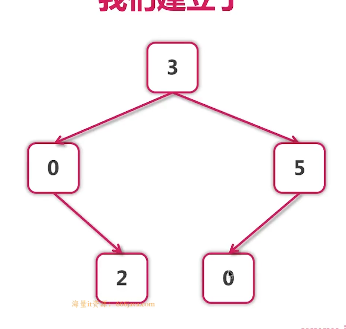

docker+k8s进行部署


全栈开发


### day1

 [go.mod](src\go.mod) 标明工作目录和go版本


 [hello.go](src\class0_hello\hello.go) 第一个程序 


`var a int`,定义int型变量,所有定义的变量都有空值(java也有)

```
fmt.Printf("%d  %q", a, b)//printf可以用%d等占位符
//"Google" + "Runoob"字符串可以直接用+连接
```

用%q可以输出引号(直接用`println`空串不显示)

###### 注意:go的变量定义了必须被使用,不能有没有使用的变量

```
var a, b, c, d = 3, 4, true, "def"
	q, w, e, r := 4, 2, false, "dasd"
```

###### ` { `不能单独放在一行

##### 变量类型

bool,string,(u)int,(u)int8,(u)int16,(u)int32,(u)int64,uintptr,byte,rune(类char,)
float32,float64,complex64,complex128

没有long,直接用`int多少`来代替,uintptr是指针,complex是复数,各占一半的位置 [euler.go](src\class0_hello\euler.go) 欧拉公式 1+e(iΠ)=0

 [nil.go](src\class0_hello\nil.go) 各个变量初值,全局变量可以声明但不使用,`unsafe.Sizeof(i)`类似c的sizeof(),但是在unsafe包中,unsafe包使程序高效,但是可能会导致不安全问题

###### iota [iota.go](src\class0_hello\iota.go) 

使用iota在const块中得到自增值,a=0,b=1,c=2

函数外的每个语句都必须以关键字开始（`var`, `func` 等等），因此 `:=` 结构不能在函数外使用。

```go
const (
    a = iota
    b
    c
)
```

**注意,go只有强制类型转换**

 [var_iota.go](src\class0_hello\var_iota.go) ,

当使用等号 `=` 将一个变量的值赋值给另一个变量时，如：`j = i`，实际上是在内存中将 i 的值进行了拷贝：

&i 获取变量 i 的内存地址


##### `if	switch` [branch.go](src\class0_hello\branch.go) 

if的条件不需要(),`} else {`必须在同一行

`switch`不需要break,除非用fallthrout,switch的条件也可以用判断来执行


##### `for循环` [for.go](src\class0_hello\for.go) ,没有while,但是有和while类似的用法

死循环常用于并发语句,非常好写

```go
for{
执行语句
}
```

文件中有`for`的使用方法和`range`的


##### 函数


举个例子

```go
func bino(num int) string{
    执行语句
}
```

返回值在()后面,可以带多个返回值

```
func bino(a,b,c int,d float) (string,int,string){
    执行语句
}

_,q,_=bino(...)//表示只接收中间的值
```


函数式编程,函数作为函数的参数加入运算

```
func apply(op func(int) string, a int) string {//函数可以嵌套函数,名字在前,类型在后
```


```go
func sum(values ...int) {//传入不定长的int数组
```

传入不定长的数组


###### 引用传递通过指针来实现

```go
func swap1(a, b *int) {//引用传递
   *a, *b = *b, *a
}
```


###### 函数作为实参

```go
func bino(num int) string { //返回二进制值

}
func apply(op func(int) string, a int) string { //函数可以嵌套函数,名字在前,类型在后
    
}   

apply(bino, 5)
```

apply函数可以接收一个接收int参数,返回string 类型的函数作为实参
从而实现函数嵌套


###### 闭包 :函数返回一个函数(跟匿名函数一起讲了)[anonymous function.go](src\class0_hello\anonymous function.go) 

Go 语言支持匿名函数，可作为闭包。**匿名函数**是一个"内联"语句或表达式。匿名函数的优越性在于**可以直接使用函数内的变量，不必申明**。

即可以在**需要使用函数时再定义函数**,此时函数作为变量被调用,建议看看以上文件中的两个例子


##### defer延迟调用

`defer `看作**将语句放入栈**中，return时才从栈取出语句执行

```go
func try(){
defer fmt.Println(1)
defer fmt.Println(2)
fmt.Println(3)
return //只要return了就执行defer，不怕中间退出就忘掉了
//panic("error")//甚至panic也可以触发defer
fmt.Println(4)
}
```

输出

```
3
2
1
```

1. defer在函数结束时发生
2. 参数在defer语句时计算(当时是10,最后变成1000的参数在defer语句中还是当成10看)
3. defer列表先进后出(栈)

defer常用于:

1. 文件打开后的关闭
2. 写入和刷新flash
3. lock和unlock等,见下面

```go
func writeFile(filename string) {
	file, err := os.OpenFile(filename,
		os.O_EXCL|os.O_CREATE|os.O_WRONLY, 0666)

	if err != nil {
		if pathError, ok := err.(*os.PathError); !ok {
			panic(err)
		} else {
			fmt.Printf("%s, %s, %s\n",
				pathError.Op,
				pathError.Path,
				pathError.Err)
		}
		return
	}
	defer file.Close()//打开文件就要关闭

	writer := bufio.NewWriter(file)
	defer writer.Flush()//写入文件要刷新

	f := fib.Fibonacci()
	for i := 0; i < 20; i++ {
		fmt.Fprintln(writer, f())
	}
}
```


##### 指针:

```
var pa *int = &a //指针
*pa = 3          //指针解引用
```

go只有值传递,但是可以通过传递指针的方式来实现引用传递

`p:= &a`简单指针赋值

当一个指针被定义后没有分配到任何变量时，**它的值为 nil**。

**nil 指针也称为空指针**。

```go
if(ptr == nil)
```

判断是否为空指针

 [array point.go](src\class0_hello\array point.go) 数组指针

`var arr0 = new([3]int)`如此方法定义的数组,**arr0是数组指针**而非数组,需要注意


##### 数组 [arrays.go](src\class0_hello\arrays.go) 

数组定义:数组是具有**相同唯一类型**的一组**已编号且长度固定**的数据项序列，这种类型可以是任意的原始类型例如整型、字符串或者**自定义类型**。

```go
var arr1 [5]int
arr2 := [3]int{1, 3, 5}
arr3 := [...]int{2, 4, 6, 8, 10}//数组长度不固定
arr4 := [5]float32{1:2.0,3:7.0}//[0 2 0 7 0],通过下标初始化
fmt.Println(len(arr1))//输出数组长度
```

数组使用

```
for i, j := range arr3 { //i得到下标,j得到元素
for _, j := range arr3 { //只要元素,不要下标
for i, _ := range arr3 { //只要下标,不要元素
```

1. [10]int和[20]int不是一个数据类型,函数调用时不通用

2. `func printArr(arr [5]int) {`函数调用是值传递,不能用来改变数组的值)

3. ```
   func printArr1(arr *[5]int) {
   printArr1(&arr3)//用指针传递的方式即可实现值改变 
   ```


```go
void myFunction(param [10]int){

}

void myFunction(param []int){

}
```

以上两种方式都能接收数组,第二种可以接收不同长度的int数组


##### Slice(切片 ) [slices.go](src\class0_hello\slices.go) 

```go
var identifier []type//声明切片,切片声明不需要长度
var slice1 []type = make([]type, len)//make函数创建切片
```


```go
	arr := [...]int{1, 2, 3, 4, 5, 6, 7, 8}
	fmt.Println("arr[2:6]", arr[2:6])
	fmt.Println("arr[:6]", arr[:6])
	fmt.Println("arr[2:]", arr[2:])
	fmt.Println("arr[:]", arr[:])
```


切片是引用而不是值传递,函数内改变值可以改变源数组

```go
func changeSlices(arr []int) {//切片标志,和上面数组标志对比一下
```

```go
	var arr = [...]int{1, 2, 3, 4, 5, 6, 7, 8}
	var s1 = arr0[2:6]
	var s2 = s1[3:5]//slice可以向后扩展,但是不能向前
	fmt.Println(s1)
	
	
	fmt.Println(s2)
	fmt.Println(len(s2))//len() 方法获取长度
	fmt.Println(cap(s2))//cap() 可以测量切片最长可以达到多少
```


```go
	var arr0 = [...]int{1, 2, 3, 4, 5, 6, 7}
	var s1 = arr0[2:6]
	var s3 = append(s1, 3, 4, 5, 6, 7)//值传递,建立新数组(更大数组)
	
	fmt.Println(s1)
	
	fmt.Println(cap(s1))
	fmt.Println(s3)
	fmt.Println(cap(s3))//s3和arr已经无关,是新的数组
```

注意,go有垃圾回收机制,如果用s1创建了s3,但是s1没有被使用,则s1会被回收

```go
	var number []int
	fmt.Println((number == nil))
```

空切片是nil


##### map集合 [map.go](src\class0_hello\map.go) 

类似python的dict

```go
var map_variable map[key_data_type]value_data_type//声明
book = make(map[string]int)//初始化map,分配确定的内存地址

book1 := make(map[string]int)
book2 := map[string]int{} //	这两开箱即用,不需要初始化
```

如果不初始化 map，那么就会创建一个 nil map。nil map 不能用来存放键值对

//会报错这个assignment to entry in nil mapmap赋值前要先初始化
需要通过**make方法分配确定的内存地址**

##### make用法

 [make.go](src\class0_hello\make.go) 

```go
make(map[string]string)//
make([]int,2)//只放len
make([]int,2,4)//len,cap 长度用的好,能避免二次分配内存,提高性能
```


##### 递归

```go
func recursion() {
   recursion() /* 函数调用自身 */
}
```

 [recursion.go](src\class0_hello\recursion.go) 递归实现阶乘的例子,参考一下吧


##### 类型转换

```go
package main

import "fmt"

func main() {
   var sum int = 17
   var count int = 5
   var mean float32
   
   mean = float32(sum)/float32(count)
   fmt.Printf("mean 的值为: %f\n",mean)
}
```

因为没有自动类型转换,所有运算都要手动统一数据类型


#### 面向对象

go仅支持封装,不支持继承和多态(用接口来实现)

##### 结构体 [structure.go](src\class0_hello\structure.go) 


结构体定义

```go
type struct_variable_type struct {
}
```


```go
var struct_pointer *book	//声明
struct_pointer = &book1		//定义
fmt.Println(struct_pointer.name)//使用
```

####  [treeNode.go](src\class0_hello\treeNode.go) 用二叉树作为面向对象的例子,好好看


```go
func createNode(value int) *treeNode { //工厂函数,专门创建treeNode类型的变量
	return &treeNode{value: value}
}
```

工厂函数,返回结构体的地址

##### 结构体方法

```go
func (node treeNode) print() {
	fmt.Println(node.value)
}


```

在结构体外定义结构体方法,`func (结构体形参  结构体类型) 方法名(形参名称)`

```go
func  print (node treeNode){
	fmt.Println(node.value)
}
```

这样子则是定义了函数,使用方法不一样但是结果没啥区别

```go
func (node *treeNode) setValue(value int) {
	node.value = value
}
```

注意,当**你需要引用传递而不是值传递时,记得使用指针参数**,在结构过大时,最好使用指针 

注意,go中nil也可以调用方法,所以方法最好加上应对nil的情况


#### 封装 

- 驼峰命名
- 首字母大写是public,小写是private

##### 包

- 一个目录一个包(可以有多个文件),可以和目录名不一样
- main包 包含可执行入口,main包只有一个 [entry.go](src\class0_hello\tree\entry\entry.go) 
- 为结构定义的方法必须在同一个包内(可以不同文件)

 这两个文件体现了包使用的方法

1. 一个文件夹内只能有一个包
2. 主运行文件必须是main包
3. 包名与文件夹名可以不相等
4. 当你找不到包的时候,可以考虑一下修改GOPATH

##### select

select 随机执行一个可运行的 case。如果没有 case 可运行且没有default，它将阻塞，直到有 case 可运行。


##### 断言assert [assert.go](src\class0_hello\assert.go) 

告诉程序自己来自哪个结构体

通过断言实现反射

###### 反射: [reflect.go](src\class0_hello\reflect.go)  

在编译时不知道类型的情况下，可更新变量、运行时查看值、调用方法以及直接对他们的布局进行操作的机制，称为反射。通俗一点就是：可以**知道本数据的原始数据类型和数据内容，方法等、并目且可以进行一定操作**(不再需要switch case来实现)


#### 扩展已有类型  [entry.go](src\class0_hello\tree_expand\entry\entry.go) 

怎么扩充系统类型或者别人定义的类?

1. 定义别名
2. 使用组合

如文件中,我们拓展了

**tree_expand.Node**结构体



前序遍历:0 2 3 4 5 
后序遍历:2 0 4 5 3 


##### 用一个先进先出队列讲述别名 [main.go](src\class0_hello\queue\entry\main.go) 

指针可以至今使用,无需重新指定 


##### OS包实现文件读写 [os](src\class0_hello\osUsage.go) 

通过OS包实现文件操作

###### io.Seeker.Seek()

`io.Seeker.Seek()`通过Seeker类的Seek方法实现光标移动

```go
type Seeker interface {
	Seek(offset int64, whence int) (int64, error)
}
```

Seek设置下一次读写份作的指针位置，每次的读写操作都是从指针位置开始的

whence=0：表示从数据的开头开出移动指针whence=1：表示从数据的当前指针位且开始移指针
whence=2：表示从数据的尾部开始移动指针SeekStart= 0//seek relative to the origin of the file
SeekCurrent =1 /seek relative to the current offset
SeekEnd 2= /seek relative to the end

offset指计移动的偏移量

其余读,写等操作见文件[os](src\class0_hello\osUsage.go) 


###### type Closer interface{Close() error}

`type Closer interface{Close() error}`一般用于关闭文件，关闭连接。关闭数据库等


#### 网络层三包

##### Net包与TCP [netTcp](src\class0_hello\netTcp)

 文件夹中分为服务端和客户端

服务端使用监听功能监听管道,并执行操作
客户端向管道写入信息并通过conn.Read(buf)接收服务端的信息


如图,在net包的net.go文件中就有监听示例


##### http包  [http](src\class0_hello\http_class) 

前后端交互常见 

重要的类型和接口:

server:服务,包含地址端口处理器等
conn:链接,用户请求来的
response:返回信息
request:用户的请求信息
Handle:对于接收的信息进行处理并且返回的一个处理器


##### RPC包 [main.go](src\class0_hello\rpc_class) 

RPC（Remote Procedure Call）远程过程调用协议，一种通过网络从远程计算机上请求服务，而不需要了解底层网络技术的协议。

G0的RPC只支持go写的系统

GoRPC的函数有特殊要求：
函数首字母必须大写
必须只有两个参数：第一个参数是接收的参数，第二个参数是返回给客户端的#数，第二个参数必须是指针类型的
函数还要有一个返回值eror


### 并发 

基本都是使用**sync包**

##### 这里讲sync.WaitGroup部分[goroutine.go](src\class0_hello\goroutine.go) 

goroutine channel

在调用一个方法的前面加上go就是goroutine,它会让方法异步执行相当于协程


WaitGroup 一共有三个方法：

```go
(wg *WaitGroup) Add(delta int)
(wg *WaitGroup) Done()
(wg *WaitGroup) Wait()
```

- `Add` 方法用于设置 WaitGroup 的计数值，可以理解为子任务的数量
- `Done` 方法用于将 WaitGroup 的计数值减一，可以理解为完成一个子任务
- `Wait` 方法用于阻塞调用者，直到 WaitGroup 的计数值为0，即所有子任务都完成

注意,必须add再wait,避免两者并发调用导致达不到预期


##### channal:不同线程沟通工具

 [channal.go](src\class0_hello\channal.go) 

```go
ch <- v    // 把 v 发送到通道 ch(写)
v := <-ch  // 从 ch 接收数据(读)
           // 并把值赋给 v
```

在没缓存的情况下
如果管道有数据，写协程阻塞；如果没数据，读协程阻塞

此处使用队列,先进先出fifo

##### 锁

注意.使用锁时都要使用指针,保证异步时锁相同

###### 1.Mutex互斥锁

 

###### 2. once

在 Go 语言中，sync 包有一个 Once 类型，官方文档介绍 Once 是一个只执行一次操作的对象。所以，Once 一般用于并发执行，但只需初始化一次的共享资源


##### 内嵌 

结构体的定义**不会被外部引用**到。在初始化这个被嵌入的结构体时，就需要再次声明结构才能赋予数据。具体请参考下面的代码 [entry.go](src\class0_hello\tree_embedding\entry\entry.go) 

建议和tree_expend对比

注意,使用

```
root.Traverse()      //用myTreeNode的方法
root.Node.Traverse() //用回Node的方法
```

`Node.Traverse()`被`root.Traverse` shadowed了,所以不能直接调用,然而这两者之间并非继承关系,起码**子类指针赋值给父类这种说法是不存在的**


##### 如何扩充系统类型或者别人的类型

- 定义别名最简单
- 使用组合：最常用
- 使用内嵌：需要省下许多代码


### GO的依赖管理


依赖管理的三个阶段

1. GOPATH
2. GOVENDOR (包管理工具)

- **go mod**(目前最好用)


直接配置go mod文件实现版本管理,简单好用


配置版本的时候不带具体版本默认最新版

##### 旧项目(用gopath,govendor的)迁移到gomod

法1:点击create go mod file即可

法2: 终端输入`go build ./...`,将路径内所有go文件全部build一遍,从而触发所有要触发的build mod

法3: 用glide.yaml文件和vendor目录装载文件,全部迁移至go mod后再删除

##### go mod优点 

go 命令统一管理

`go mod init`初始化

`go get [@v]`增加依赖,v用于版本更新

`go build [文件or目录or./...]`一次编译多个文件不能产生可执行文件,指挥看看是否能编译

`go install ./...`编译当前目录下所有文件


##### go包管理

1. 含有main函数的文件必须在单独目录里面,main函数所在的文件必须单独一个文件夹


## 第二章:go编程思想

工程化思想,模块化设计,可配置,测试,并发 

#### 接口: [urlretriever.go](src\program_thinking\urlretriever\urlretriever.go) 所在文件夹

概念:go是强类型语言,变量类型固定,在不同环境使用时容易解耦失败


```go
func getRetriever() urlretriever.Retriever {
	return urlretriever.Retriever{}
}

func main() {
	//fmt.Printf("%s\n", retrieve("https://www.imooc.com"))
	//retriever := urlretriever.Retriever{}               //创建对象
	//retriever := getRetriever()                         //用函数来代替直接使用结构体,体现了main函数和Retriever结构体的解耦
	var retriever urlretriever.Retriever = getRetriever() //体现了表明类型,好看(虽然对编译器来说和上一个一样
	fmt.Println(retriever.Get("https://www.imooc.com"))   //使用方法
}

```

如上,使用了`urlretriever.Retriever`,但如果想使用测试包中的`test.Retriever`,那就得把所有的`urlretriever.Retriever`都改成`test.Retriever`,显然不好改

##### 多态

###### 通过接口interface实现 [interface.go](src\class0_hello\interface.go)  

所以为了规避强类型的绑定,使用`interface`

通过接口，我们可以统一 **类型与行为**，非侵入性的实现允许在完全不需要改动旧代码的情况下，让 struct **实现** interface。

```go
type retriever interface {
	Get(string) string
}
```

使用这样的一个方法,使得`retriever`可以代指所有 拥有`Get(string) string`方法的结构体

###### 
